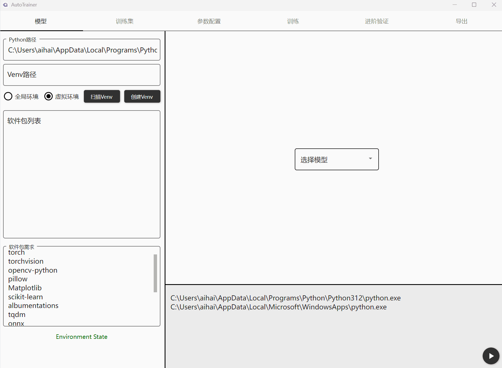
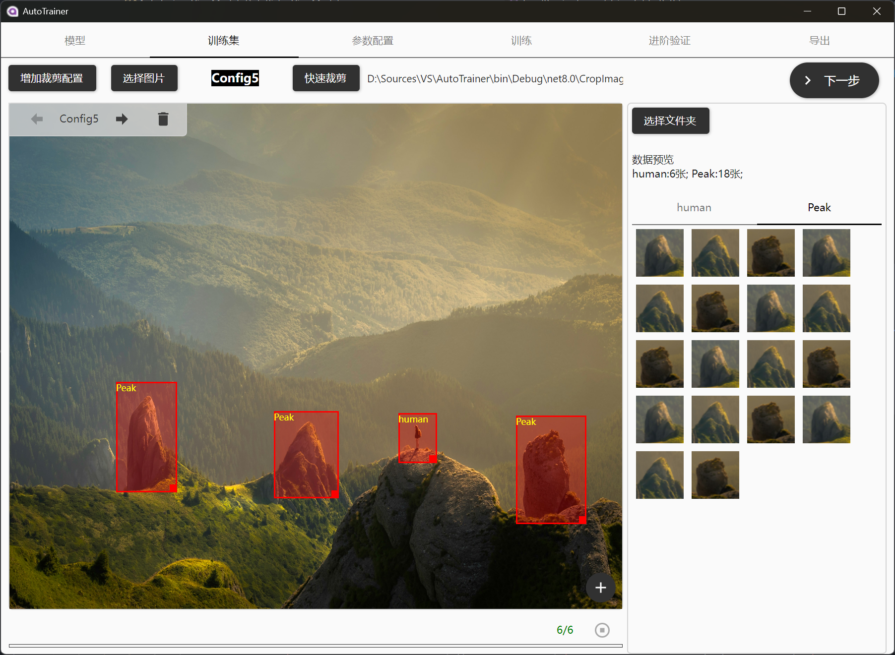
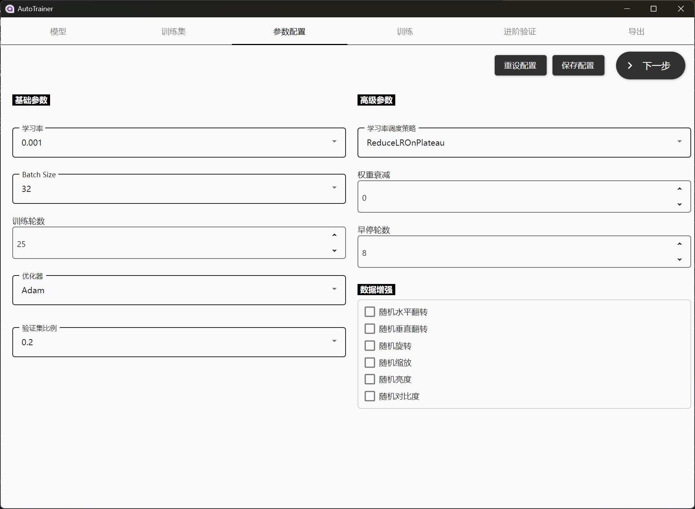
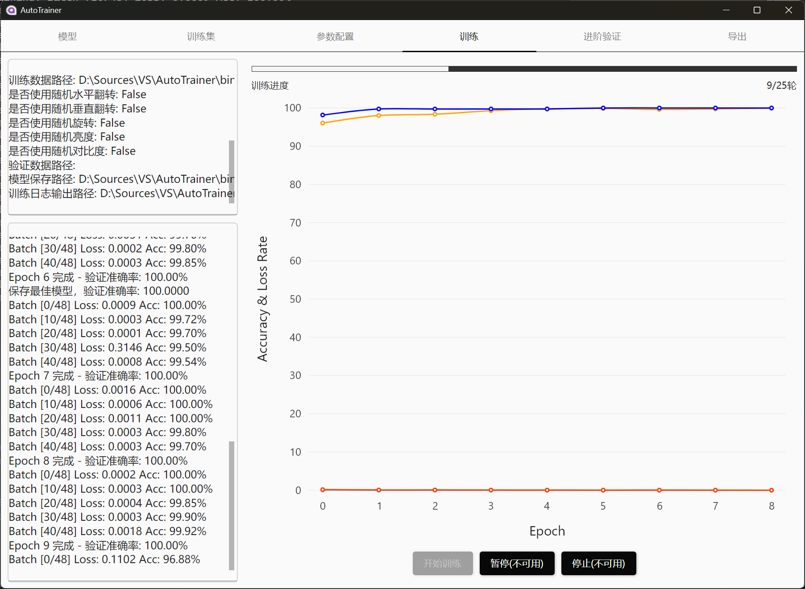

# One-Stop-trainer
## 这只是用于训练图像分类/预测回归模型的一个便捷工具
### 它可以实现的事情：
1. Python环境检查，创建虚拟环境，验证软件包，安装软件包
2. 提供了一个简单的数据标注工具，支持快速创建数据集；以及使用已存在的数据集
3. 训练前的参数调整
4. 可视化的训练过程
5. 验证训练的模型性能，支持按设定比例生成基于原始数据集的验证集，输出完整的性能报告
6. 转换格式，支持导出onnx或tensorflow模型

### 样例
1.环境配置

2.激活环境

3.选择预训练模型

4.图像标注&训练集

5.训练参数

6.训练

7.验证

## 未来要做的
- [ ] 支持使用全局python环境训练
- [ ] 训练支持暂停/停止
- [ ] 验证时可选本地数据集
- [ ] 导出页面优化
- [ ] 图像标注页增加自定义框选的标注方式
- [ ] 做回归模型的训练功能
