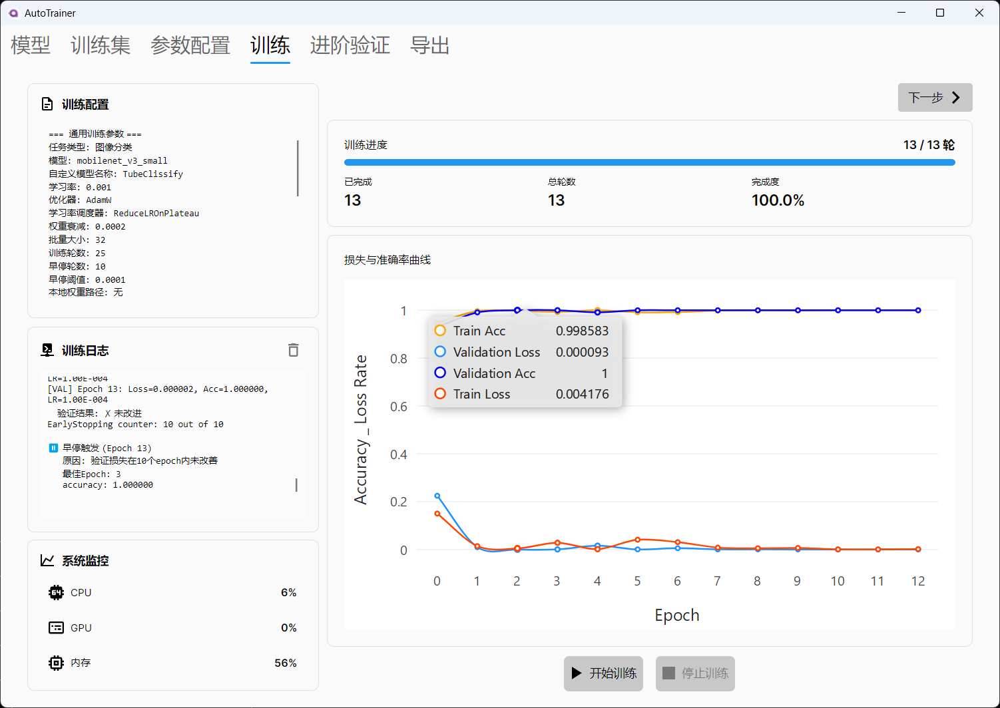
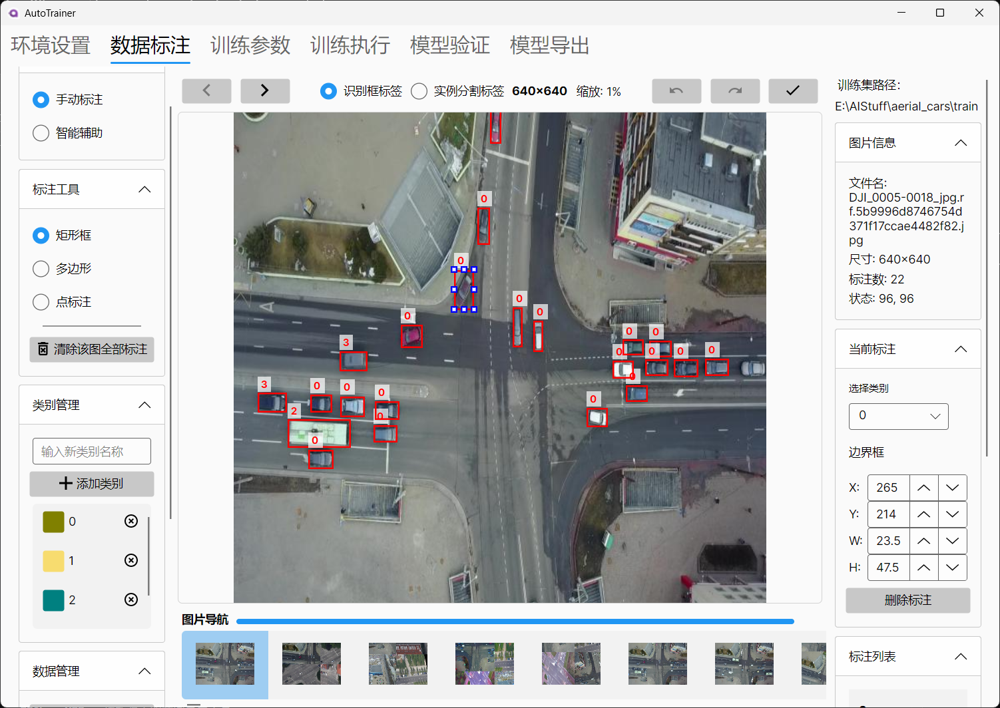

# AutoTrainer

> 一个基于 Avalonia UI 和 PyTorch 的跨平台机器学习训练工具

[](LICENSE)
[](https://dotnet.microsoft.com/download/dotnet/10.0)
[](https://github.com/mehaifeng/AutoTrainer)

---

## 项目简介

AutoTrainer 是一个功能强大的桌面应用程序，旨在简化图像分类和目标检测模型的训练流程。通过直观的图形用户界面，用户可以轻松完成从环境配置、数据标注到模型训练、验证和导出的整个机器学习工作流程。

---

## 核心功能

### 🎯 模型训练

- **图像分类** - 支持多种预训练模型：EfficientNet、MobileNetV3、ResNet、VGG、DenseNet 等
- **目标检测** - 基于 Faster R-CNN 的检测模型训练
- **自动设备检测** - 智能识别 CUDA、MPS（Apple Silicon）、CPU 等计算设备

<!-- 训练界面截图占位 -->
<p align="center">
  
  <br>
  <em>训练界面</em>
</p>

### 📝 数据标注

- **可视化标注工具** - 直观的图像标注界面
- **多种标注类型** - 矩形框、多边形、点标注
- **COCO 格式支持** - 支持主流标注格式

<!-- 数据标注界面截图占位 -->
<p align="center">
  
  <br>
  <em>数据标注界面</em>
</p>

### 🔧 环境管理

- **自动环境配置** - 一键创建 Python 虚拟环境
- **依赖包管理** - 自动安装和验证 ML 所需的 Python 包
- **跨平台支持** - Windows、Linux、macOS（含 Apple Silicon）

### 📊 模型验证

- **实时性能监控** - 训练过程中的损失和指标可视化
- **详细的验证报告** - 准确率、召回率、F1 分数等
- **可视化图表** - 混淆矩阵、PR 曲线等

### 📦 模型导出

- **多格式导出** - 支持 ONNX、TorchScript 格式
- **自定义模型名称** - 便于版本管理

---

## 技术架构

### 前端技术

| 技术 | 说明 |
|------|------|
| **.NET 10.0** | 应用程序框架 |
| **Avalonia UI** | 跨平台桌面 UI 框架 |
| **CommunityToolkit.Mvvm** | MVVM 模式实现 |
| **LiveCharts.SkiaSharpView** | 数据可视化 |
| **Serilog** | 结构化日志 |

### 后端技术

| 技术 | 说明 |
|------|------|
| **Python** | 机器学习后端 |
| **PyTorch** | 深度学习框架 |
| **torchvision** | 计算机视觉模型库 |

---

## 快速开始

### 系统要求

- **操作系统**: Windows 10+、Linux、macOS 10.15+
- **.NET Runtime**: .NET 10.0
- **Python**: Python 3.8+
- **GPU**（可选）: NVIDIA CUDA 或 Apple Silicon MPS

### 安装步骤

1. **克隆项目**
   ```bash
   git clone https://github.com/mehaifeng/AutoTrainer.git
   cd AutoTrainer
   ```

2. **构建项目**
   ```bash
   dotnet build AutoTrainer.sln
   ```

3. **运行应用**
   ```bash
   dotnet run --project AutoTrainer.csproj
   ```

---

## 项目结构

```
AutoTrainer/
├── Models/               # 数据模型
│   ├── Annotation/       # 标注相关模型
│   ├── Training/         # 训练配置模型
│   ├── Logging/          # 日志模型
│   ├── Dataset/          # 数据集模型
│   └── Crop/             # 裁剪配置模型
├── ViewModels/           # MVVM 视图模型
├── Views/                # Avalonia XAML 视图
├── Helpers/              # 辅助工具类
├── Extensions/           # 扩展方法
├── PyScripts/            # Python ML 脚本
│   ├── Training/         # 训练模块
│   ├── Inference/        # 推理验证模块
│   └── Utils/            # 工具脚本
├── Configs/              # 配置文件
└── docs/                 # 项目文档
```

---


## 路线图

### 已完成 ✅

- [x] 基础 UI 框架搭建
- [x] 图像分类模型训练
- [x] 目标检测模型训练
- [x] 数据标注工具
- [x] 模型验证与导出
- [x] 跨平台支持（Windows/Linux/macOS）
- [x] Apple Silicon MPS 支持

### 计划中 🚧

- [ ] 分割模型训练支持
- [ ] 更多预训练模型集成
- [ ] 数据增强功能增强
- [ ] 分布式训练支持
- [ ] 模型微调（Fine-tuning）工具
- [ ] 训练任务调度与管理

---

## 贡献指南

欢迎贡献代码、报告问题或提出新功能建议！

1. Fork 本项目
2. 创建特性分支 (`git checkout -b feature/AmazingFeature`)
3. 提交更改 (`git commit -m 'Add some AmazingFeature'`)
4. 推送到分支 (`git push origin feature/AmazingFeature`)
5. 开启 Pull Request

---

## 许可证

本项目采用 MIT 许可证 - 详见 [LICENSE](LICENSE) 文件

---

## 致谢

- [Avalonia UI](https://avaloniaui.net/) - 跨平台 UI 框架
- [PyTorch](https://pytorch.org/) - 深度学习框架
- [torchvision](https://pytorch.org/vision/) - 计算机视觉库
- [CliWrap](https://github.com/Tyrrrz/CliWrap) - 命令行执行库

---

## 联系方式

- **项目主页**: [https://github.com/mehaifeng/AutoTrainer](https://github.com/mehaifeng/AutoTrainer)
- **问题反馈**: [Issues](https://github.com/mehaifeng/AutoTrainer/issues)

---

<p align="center">
  <b>用 ❤️ 构建的机器学习训练工具</b>
</p>
