# 适合多数视觉模型的一站式创建和管理

工业上有许多地方可以利用视觉模型的能力处理一些实时性要求高且重复的任务，在不同项目中，这类任务的要求也不同，有的要做到极高的识别率，有的要做到极短的识别时间，有的要两者平衡，甚至有的任务要在低功耗的芯片上也能流畅执行，即使任务的最终目的都是分类或者回归，但因为侧重点不同，就必须挑选适合的模型架构去针对性的适配。因此提供一种便捷的训练和管理模型的工具就变得很必要。

## AutoTrainer
这个Demo的设想是集合“训练”+“管理”两大维度的功能。

**训练**

1. 环境配置/模型选择：Python环境检测，本机Venv虚拟环境检索，Venv创建，Pip软件包比对，安装缺失的软件包，激活虚拟环境，选择模型
2. 图像标注/数据集生成：提供了一个简单的图像标注工具，适合于工业上这种位置固定的目标；根据标注数据，选择原图片集快速生成训练用的数据集
3. 训练参数调整：基础参数+高级参数，学习率、批次、训练轮数、早停轮数等......
4. 训练：提供了一个实时的，可视化的界面
5. 进阶验证：基于数据集创建的变异数据集，在此基础上进行模型验证，输出规范的报告
6. 转换导出：提供ONNX和Tensorflow两种格式，导出后上传到模型仓库

**管理**

1. 基于用户的访问权限，展示当前项目的模型
2. 项目增减，文件和目录的上传、下载
3. 文件版本控制
   

## 设想
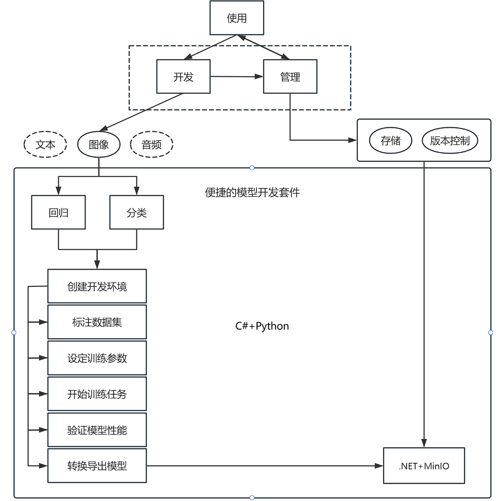

## 架构
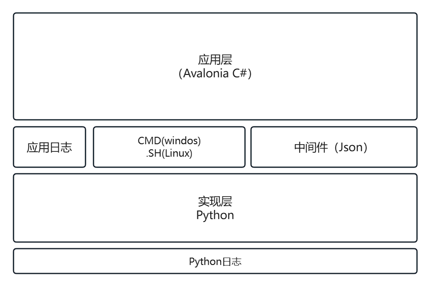

## 以下是Demo截图Gif
### 1. 扫描Venv
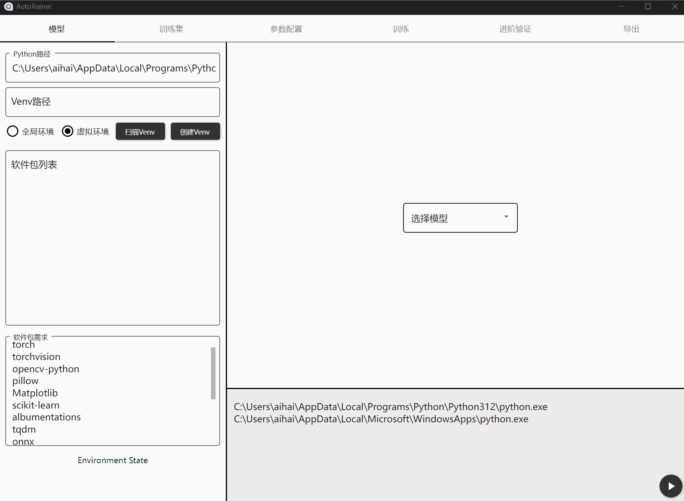

### 2. 安装软件包
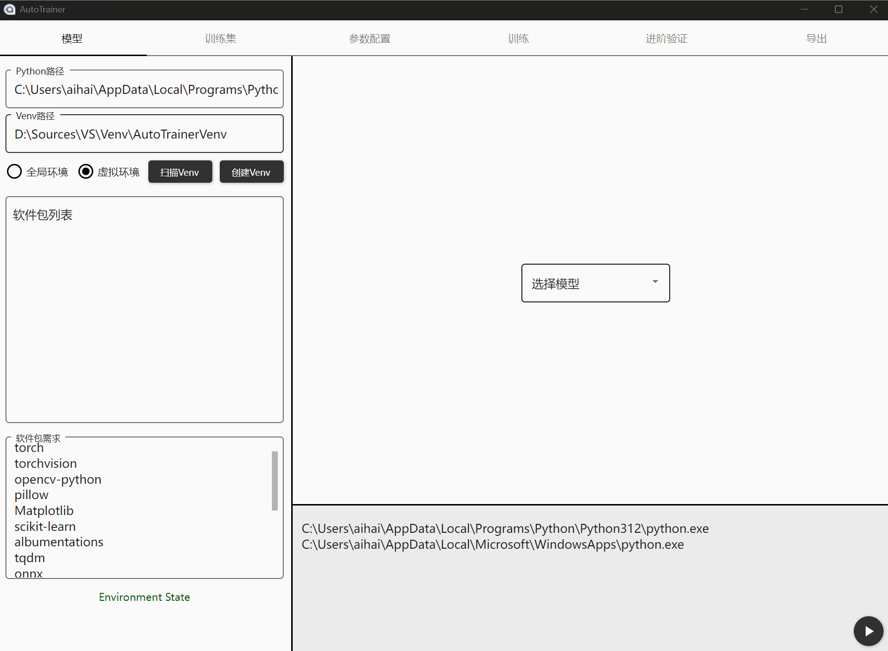

### 3. 激活Venv&选择模型
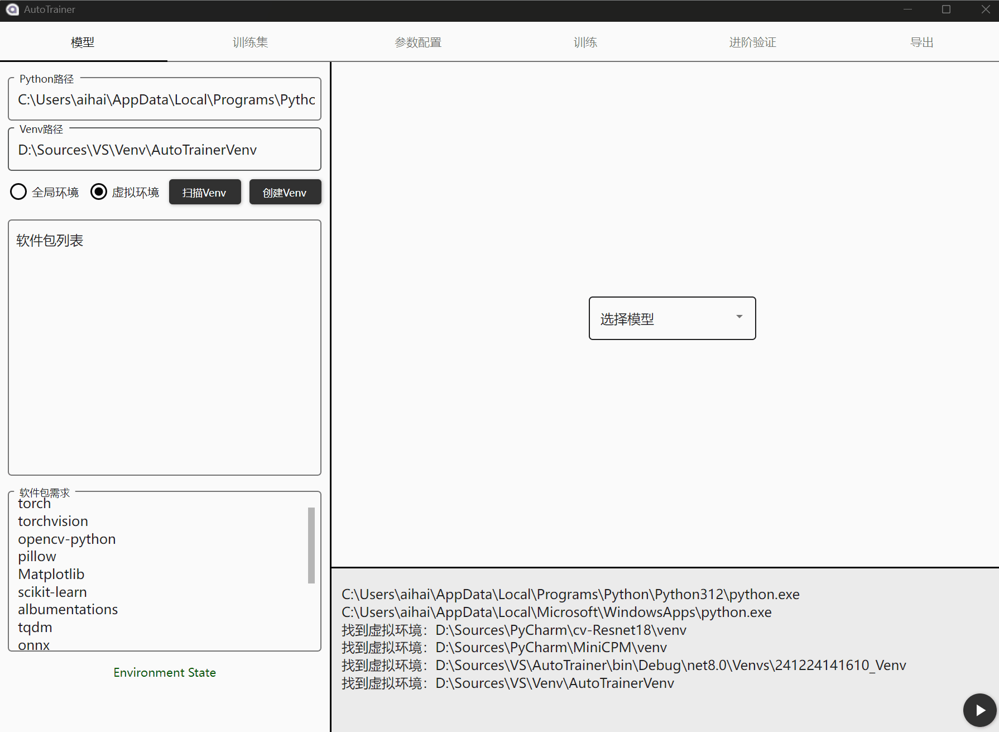

### 4. 标注数据（示例）
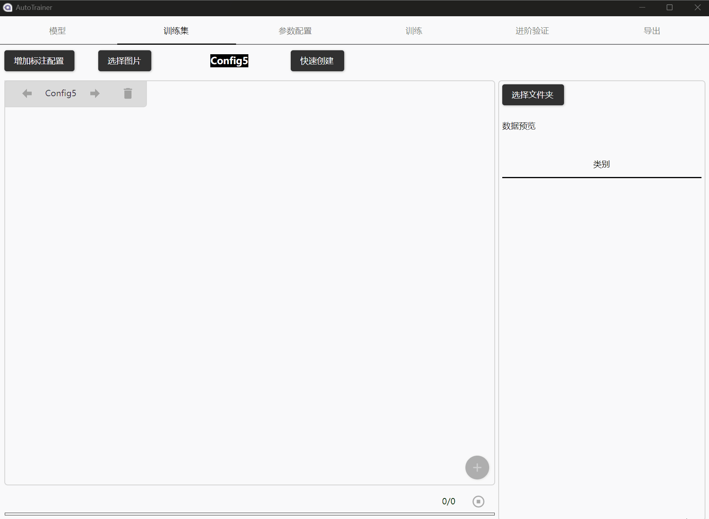

### 5. 使用本地数据集
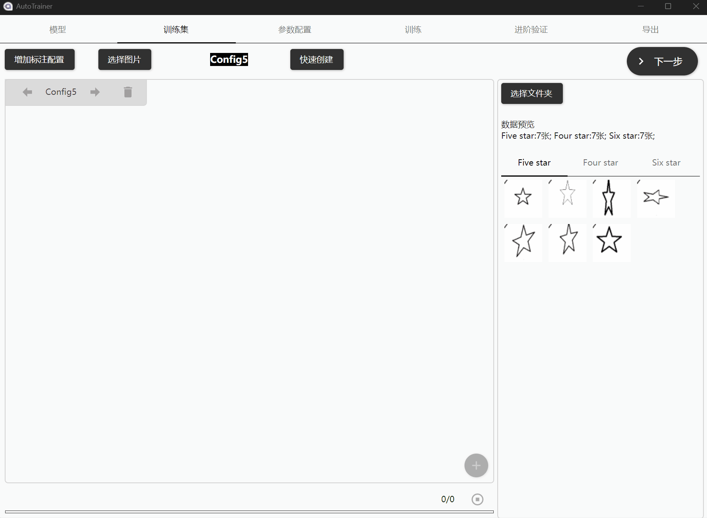

### 6. 调整训练参数
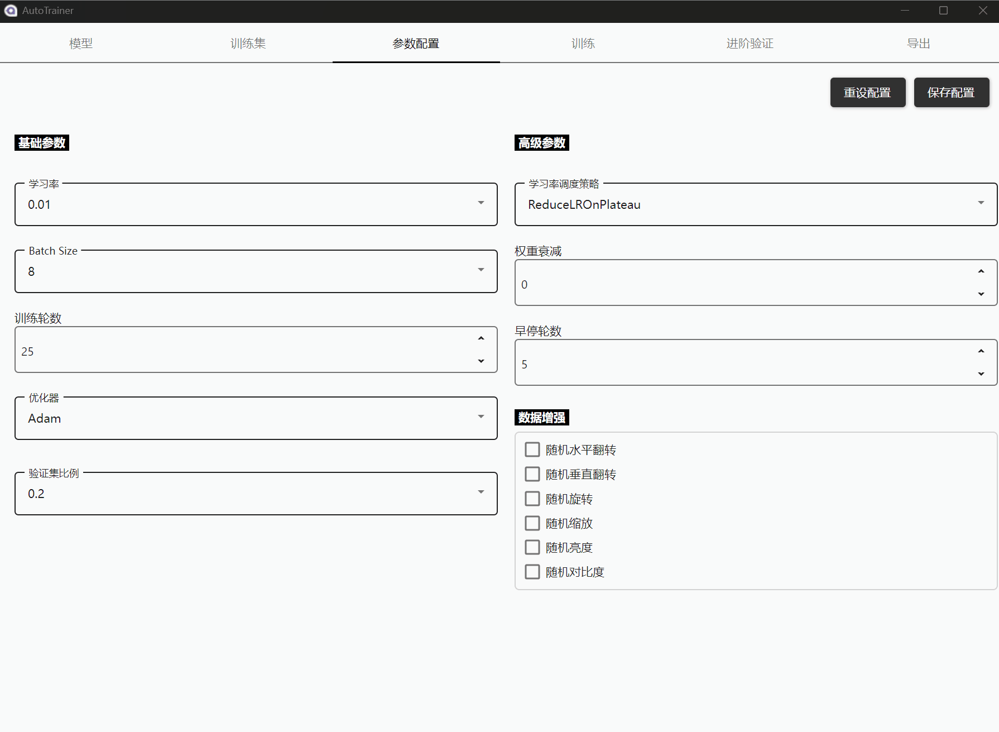

### 7. 训练少**（只有21份数据的结果，只作演示）**
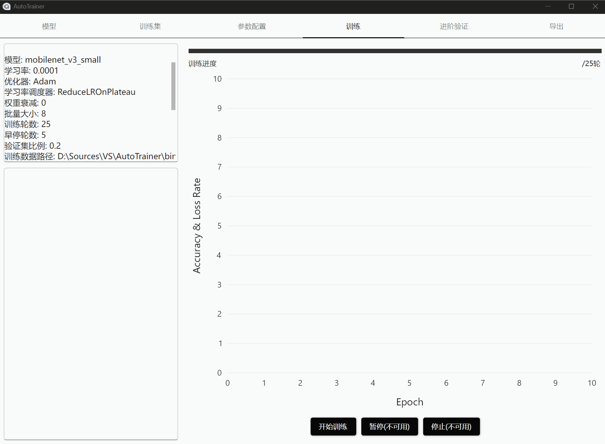

### 8. 实时训练
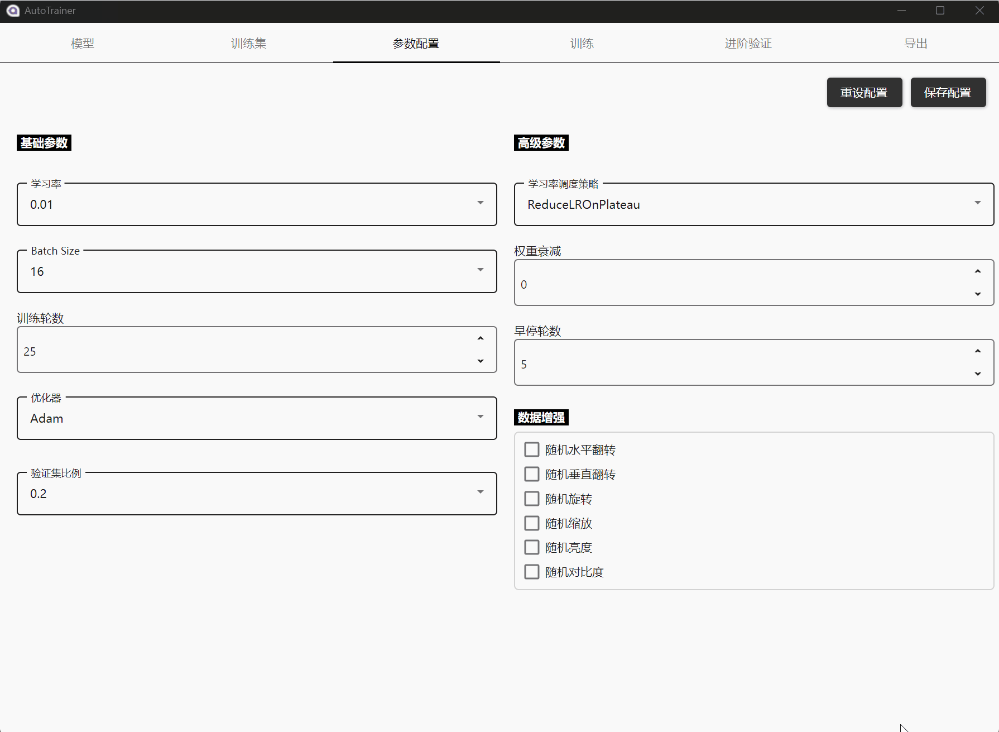

### 9. 进阶验证
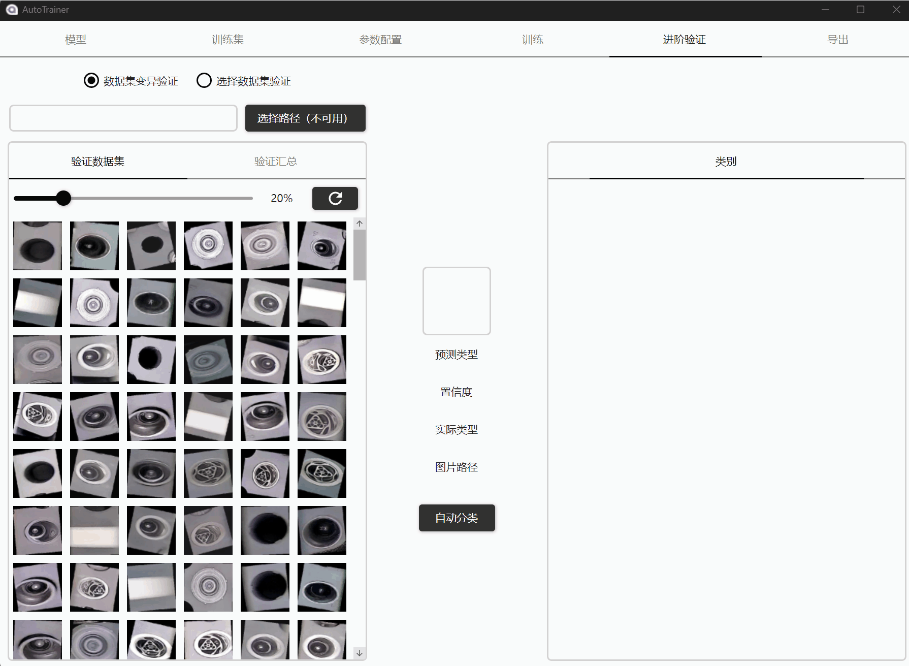

### 10. 转换后导出
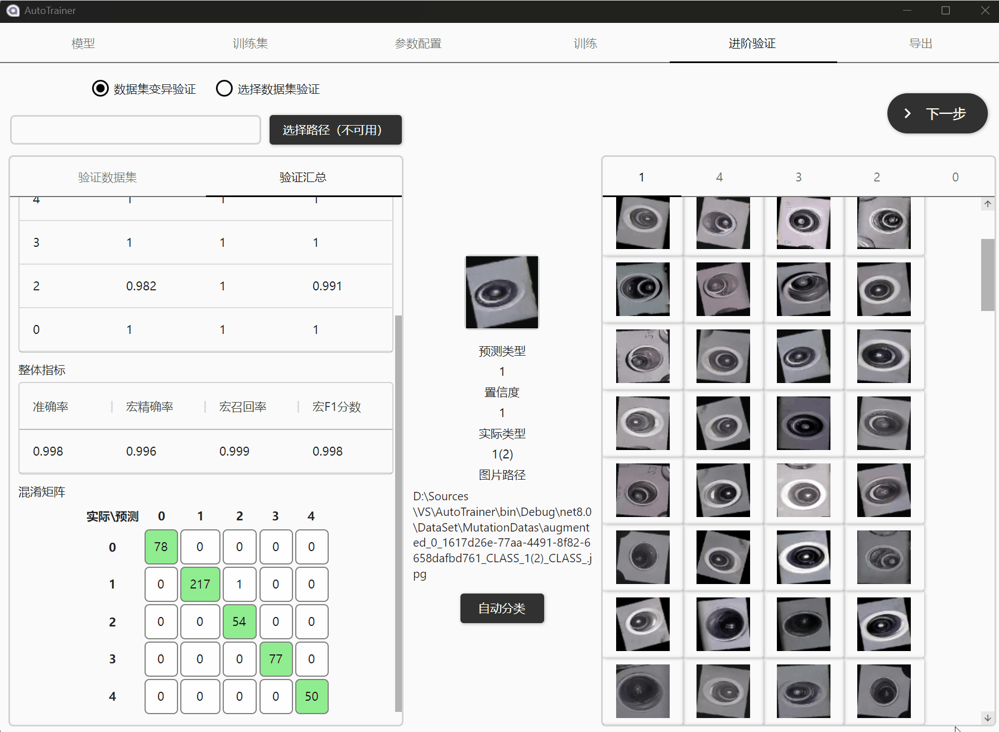

### 11. 模型仓库（前期）
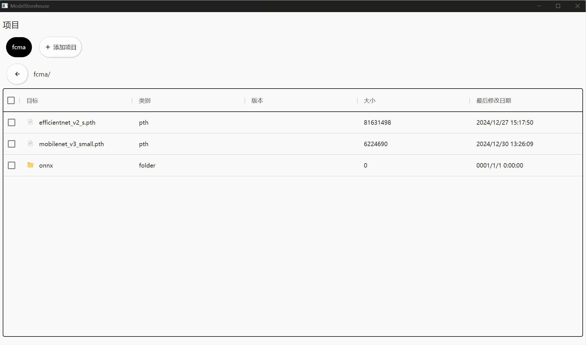