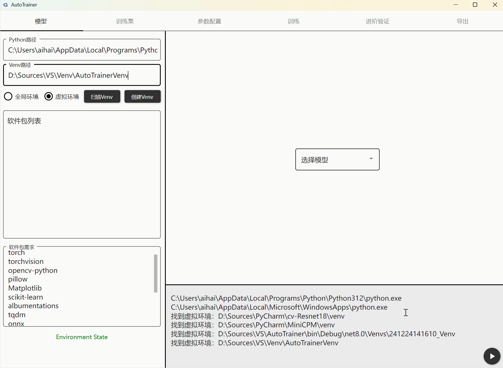
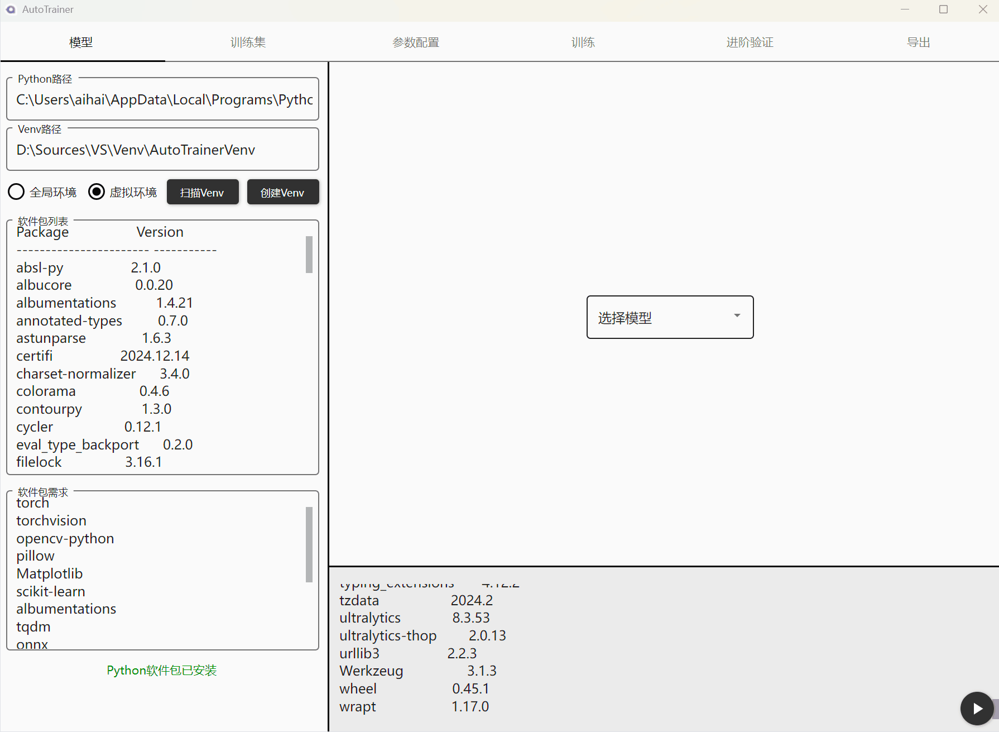
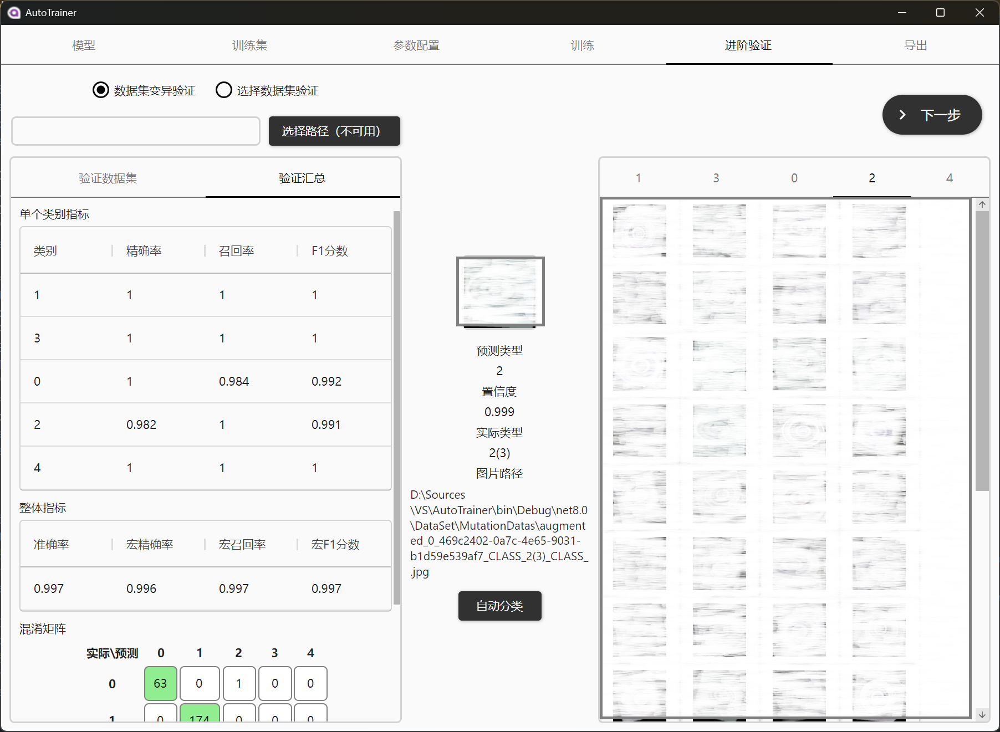

# One-Stop-trainer
## 这只是用于训练图像分类/预测回归模型的一个便捷工具
### 它可以实现的事情：
1. Python环境检查，创建虚拟环境，验证软件包，安装软件包
2. 提供了一个简单的数据标注工具，支持快速创建数据集；以及使用已存在的数据集
3. 训练前的参数调整
4. 可视化的训练过程
5. 验证训练的模型性能，支持按设定比例生成基于原始数据集的验证集，输出完整的性能报告
6. 转换格式，支持导出onnx或tensorflow模型

### 样例
1.环境配置


2.激活环境


3.选择预训练模型


4.图像标注&训练集


5.训练参数


6.训练


7.验证


## 未来要做的
- [ ] 支持使用全局python环境训练
- [ ] 训练支持暂停/停止
- [ ] 验证时可选本地数据集
- [ ] 导出页面优化
- [ ] 图像标注页增加自定义框选的标注方式
- [ ] 做回归模型的训练功能

## 分类数据集配置方式分析

当前项目在处理无需裁剪的图片进行分类时，采用的是“分类文件夹”的方式。即在`DataSet/ClassifiedImages`目录下，为每个类别创建一个文件夹，然后将对应的图片复制进去。这种方式的优点是直观、简单，并且可以直接被PyTorch的`torchvision.datasets.ImageFolder`类加载，无需额外开发。这也是目前Python训练脚本`PyScripts/ModelTrainer.py`所采用的方式。

### 备选方案：使用配置文件

一种更灵活的备选方案是使用配置文件（如`annotations.txt`或`annotations.csv`）来管理图片和类别的对应关系，而不是通过文件夹结构。所有图片可以存放在同一个目录下，而配置文件则记录了每个图片文件名及其对应的类别标签。

**示例 `annotations.txt`:**
```
image01.jpg,类别A
image02.png,类别B
image03.jpg,类别A
```

**可行性分析:**

1.  **Python端 (`PyScripts/ModelTrainer.py`):**
    *   **现状:** 目前使用的`ImageFolder`无法直接处理这种配置文件。
    *   **改造方案:** 需要在Python脚本中实现一个自定义的PyTorch `Dataset` 类。这个类将负责：
        1.  在构造函数 (`__init__`) 中读取并解析`annotations.txt`文件，将图片路径和标签加载到内存中。
        2.  实现 `__len__` 方法，返回数据集中图片的总数。
        3.  实现 `__getitem__` 方法，根据索引加载指定的图片，对其进行预处理（transform），并返回图片张量和对应的标签。
    *   **结论:** 此方案在PyTorch中是标准实践，技术上完全可行。只需要修改`ModelTrainer.py`中的`prepare_data`方法，当检测到是配置文件模式时，就实例化这个自定义的`Dataset`，否则继续使用`ImageFolder`。

2.  **C# .NET 端:**
    *   **现状:** 目前在`DatasetAnnotationViewModel.cs`的`SaveCurrentAnnotation`方法中，如果当前图片没有标注，则执行文件复制操作。
    *   **改造方案:** 将文件复制逻辑改为文件写入逻辑。即，当用户点击“保存当前标注”且无标注框时，不是复制图片文件，而是在`DataSet/annotations.txt`文件中追加一行，内容为`图片文件名,选择的类别名`。
    *   **结论:** 此方案在C#端实现起来非常简单。

**总结:**

切换到基于配置文件的分类方案是**完全可行**的。主要工作量在于Python端需要编写一个自定义的`Dataset`类来替代`ImageFolder`。这样做可以避免物理复制文件带来的冗余和低效，使数据集的管理更加灵活。
